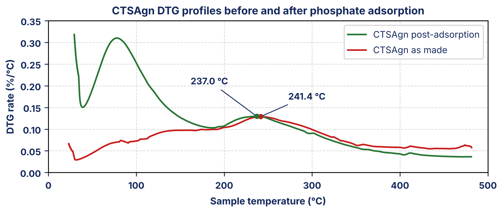

# Files used to create the expected files

## compute_answer_key.py

Reads the nine input files in `task_10/initial_files` and computes every value that appears in the two documents: the four peak temperatures and rates, the rate ratios, the 5% mass-loss ceiling, and the cost, loss-case and break-even figures. Run it from the folder that contains `task_10`.

```python
"""Recompute every graded value for the CTSAgn task from the input files.

Run from the repo root:  python3 -I task_10/answer_key/compute_answer_key.py
Reads the input files in task_10/initial_files.
"""
import csv, os, json, numpy as np, openpyxl

IN = "task_10/initial_files"
def p(name): return os.path.join(IN, name)

def load_txt(path):
    rows = []
    for line in open(path, "rb").read().decode("utf-16").splitlines():
        s = line.split("\t")
        if len(s) == 6:
            try: rows.append([float(x) for x in s])
            except ValueError: pass
    return np.array(rows)

def load_xlsx(path):
    ws = openpyxl.load_workbook(path, data_only=True).active
    return np.array([r for r in ws.iter_rows(values_only=True)
                     if r[0] is not None and all(isinstance(x, (int, float)) for x in r)], float)

RUNS = {
    "Chitosan precursor": load_txt(p("CTS.txt")),
    "Alginate precursor": load_txt(p("Agn.txt")),
    "CTSAgn as made": load_xlsx(p("CTSAgn.xlsx")),
    "CTSAgn post-adsorption": load_xlsx(p("CTSAgn_After.xlsx")),
}
# columns: time(min), T(C), weight(mg), balance purge, sample purge, deriv weight (%/C of initial mass)

out = {"thermal": {}, "cost": {}}
for name, a in RUNS.items():
    t, w, d = a[:, 1], a[:, 2], a[:, 5]
    m0 = w[0]; m150 = w[np.argmin(abs(t - 150))]
    sel = t > 150
    i = np.argmax(d[sel]); Tp, raw = t[sel][i], d[sel][i]
    dry = raw * m0 / m150                      # per cent of the 150 C mass, per C
    idx = np.where((t > 150) & (w <= 0.95 * m150))[0][0]
    out["thermal"][name] = dict(m0_mg=m0, m150_mg=m150, peak_T=Tp, peak_rate_raw=raw, peak_rate_dry=dry, T_5pct_loss_since_150=t[idx])

T = out["thermal"]; r = lambda k: T[k]["peak_rate_dry"]
C, A, M, P = "Chitosan precursor", "Alginate precursor", "CTSAgn as made", "CTSAgn post-adsorption"
out["thermal"]["_derived"] = dict(
    asmade_vs_chitosan=r(C)/r(M), asmade_vs_alginate=r(A)/r(M),
    post_vs_chitosan=r(C)/r(P), post_vs_alginate=r(A)/r(P),
    post_over_asmade_dry=r(P)/r(M), post_over_asmade_raw=T[P]["peak_rate_raw"]/T[M]["peak_rate_raw"],
    shift_C=T[P]["peak_T"] - T[M]["peak_T"],
    asmade_below_alginate_C=T[A]["peak_T"] - T[M]["peak_T"], asmade_below_chitosan_C=T[C]["peak_T"] - T[M]["peak_T"],
    ceiling_C=T[P]["T_5pct_loss_since_150"], ceiling_margin_over_175=T[P]["T_5pct_loss_since_150"] - 175,
    ceiling_below_peak_C=T[P]["peak_T"] - T[P]["T_5pct_loss_since_150"])

rows = list(csv.reader(open(p("CTSAgn_batch_economics.csv"), encoding="utf-8")))
hdr = rows[1]; ix = {h: i for i, h in enumerate(hdr)}
batches = rows[2:9]
cost_cols = ["Chitosan_Cost_$", "Alginate_Cost_$", "CaCl2_Cost_$", "Acetic_Acid_Cost_$", "Water_Utilities_$",
             "Energy_$", "Labor_$", "Equipment_Depreciation_$", "Overhead_$"]   # excludes the stated Total and Cost_per_kg columns
cash = lambda b: sum(float(b[ix[c]]) for c in cost_cols if c != "Equipment_Depreciation_$")
tot = lambda b: sum(float(b[ix[c]]) for c in cost_cols)
for b in batches:
    assert abs(sum(float(b[ix[c]]) for c in cost_cols) - float(b[ix["Total_Production_Cost_$"]])) < 1e-9, b[0]
rel = [b for b in batches if b[ix["Batch_Disposition"]] == "Released"]
rej = [b for b in batches if b[ix["Batch_Disposition"]] != "Released"]
kg = sum(float(b[ix["Adsorbent_Produced_kg"]]) for b in rel)
cap = sum(float(b[ix["Adsorbent_Produced_kg"]]) * float(b[ix["Adsorption_Capacity_mg_per_g"]]) for b in rel) / kg
def metrics(cost_total):
    perkg = cost_total / kg; perg = perkg / 1000
    return dict(cost_usd_per_kg=perkg, cost_usd_per_g=perg, capacity_mg_per_g=cap, cost_per_mg=perg / cap, efficiency_mg_per_usd=cap / perg)
bench = {"Biochar": (10, 30), "Chitosan": (200, 100), "Activated Carbon": (150, 60), "Iron Oxide": (80, 50)}
out["cost"]["benchmarks"] = {n: dict(cost_usd_per_kg=k, cost_usd_per_g=k/1000, capacity=c, cost_per_mg=k/1000/c, efficiency=c/(k/1000)) for n, (k, c) in bench.items()}
rel_cash, rej_cash = sum(cash(b) for b in rel), sum(cash(b) for b in rej)
out["cost"]["released_cash"] = dict(total=rel_cash, kg=kg, **metrics(rel_cash))
out["cost"]["rejected_cash"] = rej_cash
out["cost"]["loss_case"] = dict(total=rel_cash + rej_cash, **metrics(rel_cash + rej_cash))
closest = min(out["cost"]["benchmarks"].items(), key=lambda kv: abs(kv[1]["efficiency"] - out["cost"]["released_cash"]["efficiency_mg_per_usd"]))
beff = closest[1]["efficiency"]
be_total = cap / beff * 1000 * kg
out["cost"]["closest_benchmark"] = closest[0]
out["cost"]["efficiency_vs_closest_released"] = out["cost"]["released_cash"]["efficiency_mg_per_usd"] / beff - 1
out["cost"]["efficiency_vs_closest_loss"] = out["cost"]["loss_case"]["efficiency_mg_per_usd"] / beff - 1
out["cost"]["break_even"] = dict(max_total_for_parity=be_total, headroom=be_total - rel_cash, rejected_cash=rej_cash,
                                 headroom_share_of_rejected=(be_total - rel_cash) / rej_cash, shortfall=rej_cash - (be_total - rel_cash))
# traps the agent can fall into (kept for rubric sanity checks)
out["cost"]["trap_total_incl_depreciation"] = dict(released=sum(tot(b) for b in rel), rejected=sum(tot(b) for b in rej))
print(json.dumps(out, indent=2, default=float))
```

## make_plot.py

Draws `plot.png`, the plot placed in the PDF. It reads `CTSAgn.xlsx` and `CTSAgn_After.xlsx` from the `initial_files` folder next to it, rescales the derivative-weight signal to per cent of the mass at 150 °C, and writes `plot.png` beside the script. Needs Python 3 with matplotlib, numpy and openpyxl.

```python
"""Draws the plot used in Thermal_Stability_Assessment.pdf.
Rates are the instrument derivative-weight signal rescaled to per cent of the 150 C mass per C
(the lab note's rate basis). Template styling: title/axis text #15295d, traces c91d1d (as made) and 277534 (post-adsorption).
Run: python3 make_plot.py [height_cm]   (default 7.0 cm, width 16.59 cm = text width). Writes plot.png next to this file.
"""
import sys, pathlib, numpy as np, openpyxl, matplotlib
matplotlib.use("Agg"); import matplotlib.pyplot as plt
HERE=pathlib.Path(__file__).resolve().parent; INP=HERE.parent/"initial_files"; H=float(sys.argv[1]) if len(sys.argv)>1 else 7.0
def lx(p):
    ws=openpyxl.load_workbook(p,data_only=True).active
    return np.array([r for r in ws.iter_rows(values_only=True) if r[0] is not None and all(isinstance(x,(int,float)) for x in r)],float)
NAVY="#15295d"; RED="#c91d1d"; GREEN="#277534"
W_IN=16.59/2.54; H_IN=H/2.54
fig,ax=plt.subplots(figsize=(W_IN,H_IN),dpi=300)
runs=[(str(INP/"CTSAgn.xlsx"),"CTSAgn as made",RED,(26,16)),(str(INP/"CTSAgn_After.xlsx"),"CTSAgn post-adsorption",GREEN,(-62,30))]
res={}
for p,label,col,off in runs:
    a=lx(p); t,w,d=a[:,1],a[:,2],a[:,5]; y=d*w[0]/w[np.argmin(abs(t-150))]   # per cent of the 150 C mass, per C
    ax.plot(t,y,color=col,lw=1.5,label=label,zorder=3)
    m=t>150; i=np.argmax(y[m]); tp,yp=t[m][i],y[m][i]; res[label]=(tp,yp)
    ax.plot(tp,yp,"o",color=col,ms=4,zorder=4)
    ax.annotate(f"{tp:.1f} °C",(tp,yp),xytext=off,textcoords="offset points",color=NAVY,fontsize=8.5,fontweight="bold",
                arrowprops=dict(arrowstyle="-",color=NAVY,lw=0.8),zorder=5)
ax.set_xlim(0,500); ax.set_ylim(0,0.35); ax.set_xticks(range(0,501,100)); ax.set_yticks(np.arange(0,0.351,0.05))
ax.set_xlabel("Sample temperature (°C)",color=NAVY,fontsize=9,fontweight="bold"); ax.set_ylabel("DTG rate (%/°C)",color=NAVY,fontsize=9,fontweight="bold")
ax.set_title("CTSAgn DTG profiles before and after phosphate adsorption",color=NAVY,fontsize=10,fontweight="bold",pad=6)
ax.tick_params(colors=NAVY,labelsize=8.5); [l.set_fontweight("bold") for l in ax.get_xticklabels()+ax.get_yticklabels()]
ax.grid(True,ls="--",lw=0.6,color="#d7d7d7",zorder=0)
for s in ax.spines.values(): s.set_color("black"); s.set_linewidth(0.8)
h,l=ax.get_legend_handles_labels(); order=[l.index("CTSAgn post-adsorption"),l.index("CTSAgn as made")]   # template order
leg=ax.legend([h[i] for i in order],[l[i] for i in order],loc="upper right",fontsize=8.5,frameon=True,edgecolor="#d7d7d7",framealpha=1)
for t_ in leg.get_texts(): t_.set_color(NAVY)
fig.tight_layout(pad=0.4); fig.savefig(HERE/"plot.png"); print("peaks",res, "fig %.2f x %.2f cm"%(W_IN*2.54,H))
```

## tsa.html

The content of `Thermal_Stability_Assessment.pdf`: the heading, the peak table, `plot.png` and the four paragraphs. Open it in LibreOffice Writer with `plot.png` in the same folder and export to PDF, or run:

```bash
soffice --headless --convert-to pdf --infilter="HTML (StarWriter)" tsa.html
```

```html
<html><head><meta charset="utf-8"><title>Thermal stability assessment: CTSAgn composite</title><style>
@page{size:8.5in 11in;margin:2.5cm}
body{font-family:"Liberation Sans";font-size:10pt;line-height:1.15}
h1{font-family:"Liberation Sans";font-size:14pt;margin:0 0 2pt} p{margin:0 0 4pt} .s{font-style:italic;margin-bottom:4pt}
table{border-collapse:collapse;width:100%;margin:2pt 0 4pt} td,th{border:1px solid #000;padding:1pt 4pt;font-size:10pt;text-align:left}
th{background:#dbe3f0}
</style></head><body>
<h1>Thermal stability assessment: CTSAgn composite</h1>
<p class="s">Primary degradation peaks from the September 2018 TGA campaign, read above the water step. Rates are per cent of the 150 °C mass per °C.</p>
<table border="1" cellpadding="3" cellspacing="0" width="627"><col width="190"><col width="205"><col width="232"><tr><th width="190" align="left" bgcolor="#dbe3f0">Material</th><th width="205" align="left" bgcolor="#dbe3f0">Peak temperature (°C)</th><th width="232" align="left" bgcolor="#dbe3f0">Peak DTG rate (%/°C)</th></tr>
<tr><td>Chitosan precursor</td><td>305.2</td><td>1.120</td></tr><tr><td>Alginate precursor</td><td>246.8</td><td>1.270</td></tr>
<tr><td>CTSAgn as made</td><td>241.4</td><td>0.129</td></tr><tr><td>CTSAgn post-adsorption</td><td>237.0</td><td>0.130</td></tr></table>
<p style="margin-top:6pt"></p>
<p>On the lab’s 150 °C basis the as-made composite’s peak mass-loss rate is 8.7 times lower than chitosan’s and 9.9 times lower than alginate’s; after loading the factors are 8.6 and 9.8. The composite’s peak rate is essentially unchanged by adsorption (0.129 to 0.130 %/°C, +0.6%). On the instrument’s initial-mass column it would appear to fall by 14%, but that is the extra water the loaded sample carries, not a change in how fast the dry material decomposes.</p>
<p>The composite peak at 241.4 °C lies below both precursors, 5.4 °C below alginate and 63.8 °C below chitosan, not between them. Its position and the absence of a chitosan-like event near 305 °C are consistent with an alginate-associated decomposition; the traces alone cannot prove the mechanism.</p>
<p>After loading, the peak moves down 4.4 °C, from 241.4 to 237.0 °C. A lower peak temperature is not by itself evidence of earlier onset. Sorbed phosphate and counter-ions may alter the alginate-rich network, but that is a hypothesis, and with the peak rate unchanged neither observation shows stabilisation or earlier breakdown.</p>
<p>For the recovered material, 5% of the mass held at 150 °C has been lost by about 195 °C under the nitrogen ramp. This is the screening handling/regeneration ceiling, about 42 °C below its peak-rate maximum. It is not a demonstrated safe service limit or a measurement of repeated-cycle capacity retention. Regeneration_Guidance_Bulletin.pdf quotes a higher blanket figure of 220 °C, drawn from other products and never measured on this lot; the 195 °C from this material’s own trace is the better-supported basis.</p>
</body></html>
```

## acc.html

The content of `Adsorbent_Cost_Comparison.docx`: the benchmark table and the Notes, Manufacturing-loss case, Break-even and Adoption sections. Convert it to Word format with LibreOffice Writer:

```bash
soffice --headless --convert-to "docx:MS Word 2007 XML" --infilter="HTML (StarWriter)" acc.html
```

After converting, two small edits were made inside the .docx: the left and right indent (200 twips) was removed from the Heading 2 style in `word/styles.xml`, so the headings line up with the body text, and the page margins in `word/document.xml` were set to 1419 twips (2.503 cm) on all four sides.

```html
<html><head><meta charset="utf-8"><title>Adsorbent cost comparison</title><style>
@page{size:8.5in 11in;margin:2.5cm}
body{font-family:"Liberation Sans";font-size:10.5pt;line-height:1.2}
h1,h2{margin-left:0;padding-left:0;text-indent:0}
h1{font-family:"Liberation Sans";font-size:15pt;margin:0 0 2pt}
h2{font-family:"Liberation Sans";font-size:12pt;margin:10pt 0 2pt}
p{margin:0 0 5pt} .s{font-style:italic}
</style></head><body>
<h1>Adsorbent cost comparison</h1>
<p class="s">CTSAgn against the four benchmark adsorbents, on the cash cost of released product.</p>
<table border="1" cellpadding="3" cellspacing="0" width="627"><col width="125"><col width="82"><col width="82"><col width="88"><col width="138"><col width="112">
<tr><th align="left" bgcolor="#dbe3f0"><font size="2">Adsorbent</font></th><th align="right" bgcolor="#dbe3f0"><font size="2">Cost ($/kg)</font></th><th align="right" bgcolor="#dbe3f0"><font size="2">Cost ($/g)</font></th><th align="right" bgcolor="#dbe3f0"><font size="2">Capacity (mg/g)</font></th><th align="right" bgcolor="#dbe3f0"><font size="2">Cost per mg removed ($/mg)</font></th><th align="right" bgcolor="#dbe3f0"><font size="2">Efficiency (mg/$)</font></th></tr>
<tr><td>Biochar</td><td align="right">10.00</td><td align="right">0.01000</td><td align="right">30</td><td align="right">0.000333</td><td align="right">3000.0</td></tr>
<tr><td>Chitosan</td><td align="right">200.00</td><td align="right">0.20000</td><td align="right">100</td><td align="right">0.002000</td><td align="right">500.0</td></tr>
<tr><td>Activated Carbon</td><td align="right">150.00</td><td align="right">0.15000</td><td align="right">60</td><td align="right">0.002500</td><td align="right">400.0</td></tr>
<tr><td>Iron Oxide</td><td align="right">80.00</td><td align="right">0.08000</td><td align="right">50</td><td align="right">0.001600</td><td align="right">625.0</td></tr>
<tr><td>CTSAgn</td><td align="right">42.92</td><td align="right">0.04292</td><td align="right">150</td><td align="right">0.000286</td><td align="right">3494.9</td></tr></table>
<h2>Notes</h2>
<p>CTSAgn is costed on the five released pilot batches (1 to 5): $2,146 of cash cost over 50 kg, which is $42.92/kg at the released-batch capacity of 150 mg/g. Cash cost is every pilot cost line except equipment depreciation, as the stage-gate policy defines it. Batches 6 and 7 were rejected off spec and are not in this figure. Cost per mg removed is the cost per gram of adsorbent divided by its capacity in mg/g. Efficiency is the reciprocal of that figure, in mg of phosphate removed per dollar of adsorbent.</p>
<p>The closest benchmark on efficiency is biochar at 3000.0 mg/$. CTSAgn is at 3494.9 mg/$, 16.5% better, at $0.000286 per mg removed against biochar’s $0.000333.</p>
<h2>Manufacturing-loss case</h2>
<p>Carrying the cash cost of all seven pilot batches ($3,093) on the 50 kg actually released gives $61.86/kg ($0.06186/g). At the released-batch capacity of 150 mg/g that is $0.000412 per mg removed and an efficiency of 2,424.8 mg/$, which is 19.2% below biochar. The efficiency lead reverses. This is a sensitivity and does not replace the table entry.</p>
<h2>Break-even</h2>
<p>CTSAgn matches biochar’s efficiency at $50.00/kg, which is $2,500 for 50 kg. The released product can therefore absorb $354 more than the $2,146 already charged. The rejected batches cost $947 in cash, so that headroom covers about 37% of it and $593 cannot be absorbed.</p>
<h2>Adoption</h2>
<p>Hold for validation. Efficiency passes on the table basis but fails on the manufacturing-loss basis. The recovered composite’s 195 °C handling ceiling is 20.4 °C above the 175 °C regeneration temperature the benchmark costing assumes, short of the 25 °C margin the policy requires. The trade group’s 220 °C figure is not counted, because it was never measured on this material. The benchmark’s three-cycle regeneration has not been demonstrated on CTSAgn: no cycle data exist. Resolve the manufacturing losses and run cycle testing before reconsidering.</p>
</body></html>
```

## plot_template_updated.xcf

Kept from the earlier version of this task. Compared with `plot_template.xcf`, only the two trace lines and their legend swatches differ (amber to `c91d1d`, blue to `277534`); the text is unchanged.
