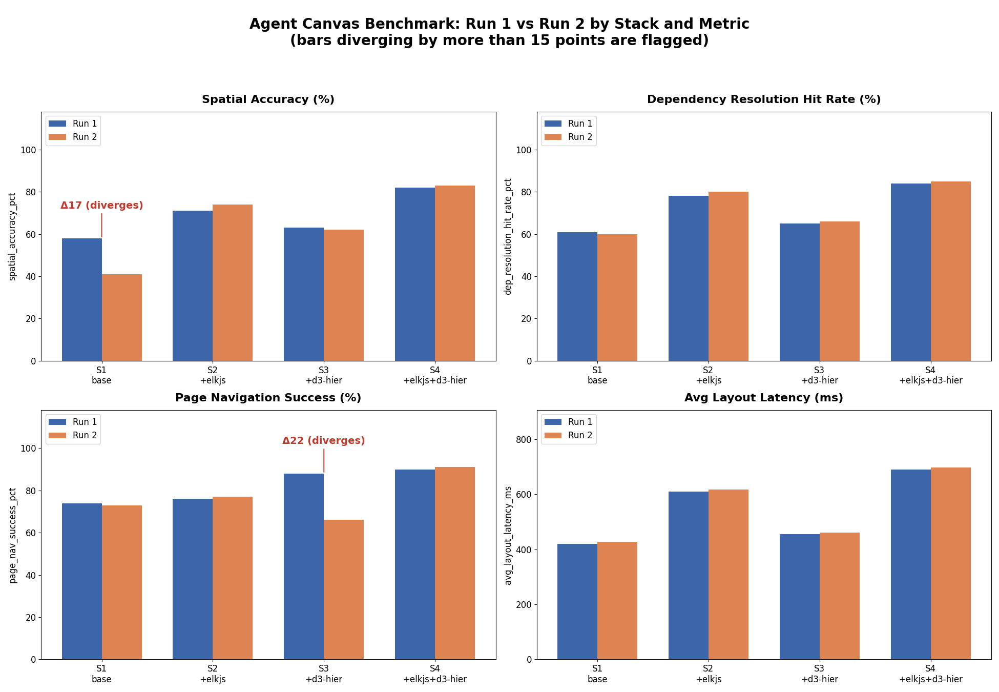

# Canvas Agent Evidence Pack: Do We Need elkjs and d3-hierarchy?

## Background
Agents that operate on a node-based canvas (react-flow) need to autonomously answer three questions
without a human in the loop: where should a new node go, which page/view should be opened, and what
does a given node depend on. That means the agent needs reliable, structured access to node bounding
boxes, z-order, page membership, and dependency edges — not just a pretty rendered canvas. This pack
resolves the open question of whether the base stack (`react-flow + roughjs + dagre`) already exposes
enough of that structure, or whether `elkjs` and/or `d3-hierarchy` are necessary additions.

## Benchmark evidence

Two independent benchmark runs were compared across four stacks and four metrics, with each stack's
score averaged across 6 individual trials per run (24 trial-level rows per run file) rather than a
single reading — so the pattern below reflects repeated-trial behavior, not one-off noise. Two bars
diverge by more than 15 points between the run averages: `S1` (base stack) on spatial accuracy (Δ17),
and `S3` (`+d3-hierarchy`, no `elkjs`) on page-navigation success (Δ22). Every stack that includes
`elkjs` (`S2`, `S4`) stays comfortably under that 15-point threshold on every metric, typically within
single digits.

Latency moves in the opposite direction from the accuracy metrics. Average layout latency rises
consistently with each addition — ~420 ms for `S1`, ~455 ms for `S3`, ~610 ms for `S2`, and ~690 ms
for `S4` — with run-to-run agreement inside 8 ms everywhere. Adding `elkjs` accounts for most of it:
roughly 190 ms on the base stack (`S1` → `S2`) and ~235 ms alongside `d3-hierarchy` (`S3` → `S4`).
The full stack is the slowest tested configuration by roughly 65% over the base stack, and unlike the
accuracy metrics this ordering is stable across both runs.

## Reconciled capability-notes findings

The two assessor sources disagreed on four points: whether `roughjs` exposes bounding-box metadata
natively, whether `dagre` alone is sufficient for dependency resolution, whether `elkjs` is necessary,
and whether `d3-hierarchy` is needed for page context. The full reconciliation table from
`library_delta_table.md` is reproduced below, followed by the short version.

| # | Conflict | Source A says | Source B says | What the benchmark shows | Reconciliation |
|---|---|---|---|---|---|
| 1 | Does `roughjs` expose bounding-box metadata natively? | Yes, the bounding box is readable directly off the rendered element, no extra tooling needed. | No, `roughjs` only draws; a custom serializer is required to capture geometry as structured metadata. | Stack S1 (`react-flow + roughjs + dagre`, no `elkjs`, no serializer-equivalent layer) swings from 58.0% to 41.0% spatial accuracy between runs, a 17-point gap. That's the largest divergence of any stack on this metric, and the second-largest in the whole dataset behind S3's page-navigation swing (see row 3). Every stack that adds `elkjs` (S2, S4) stays under 5 points across runs. | The instability is only present when nothing besides `roughjs`/`dagre` is doing layout bookkeeping. That pattern matches Source B: if `roughjs` reliably exposed bounding boxes on its own, spatial accuracy should be stable run-to-run regardless of what else is in the stack, not swing by 17 points. **Source B's account is better supported by the evidence.** |
| 2 | Is `dagre` alone sufficient for dependency resolution? | Yes, `dagre`'s graph object fully covers predecessor/successor traversal. | Implied no above ~40 nodes, but not directly about dependency resolution itself. | `dep_resolution_hit_rate_pct` is the most run-to-run stable metric across all four stacks in both runs, with deltas of just 1-2 points everywhere, including S1 with no `elkjs`. But its absolute level is not uniform: S1 averages only ~60-61%, while the `elkjs`-equipped stacks (S2, S4) reach ~78-85%. | Dependency resolution is the most *consistent* metric in the dataset, which supports Source A's claim that `dagre` resolves dependencies predictably. But consistency is not the same as sufficiency: a ~60-61% hit rate means roughly 2 in 5 dependency lookups still miss, meaningfully below the ~78-85% the `elkjs`-equipped stacks reach. **The evidence does not support Source A's "fully covers" framing.** `dagre` resolves dependencies stably, just not as completely as the `elkjs`-based stacks. |
| 3 | Is `elkjs` required? | No, recommend against it; it adds bundle size and complexity without payoff. | Yes, required for multi-page graphs, especially page-level layout consistency. | The two stacks that include `elkjs` (S2, S4) are the most run-to-run stable across every metric, and S3 (`+d3-hierarchy`, no `elkjs`) shows the single worst divergence in the dataset: page-navigation success drops from 88.0% to 66.0%, a 22-point swing. Latency moves the other way. Adding `elkjs` costs roughly 190 ms on the base stack (S1 ~420 ms to S2 ~610 ms) and ~235 ms alongside `d3-hierarchy` (S3 ~455 ms to S4 ~690 ms), consistent to within 8 ms across both runs. | Both sources are partly right, on different axes. Source A's stated objection was bundle size and complexity, not runtime speed. The benchmark only measures layout latency, not bundle size, so it can't directly confirm or refute that specific claim. What the latency data does show is a related but distinct cost: `elkjs` is the single largest latency addition in the set. That's a real trade-off worth weighing, even though it isn't the measurement Source A actually cited. On the reliability question, A is not supported: adding `d3-hierarchy` without `elkjs` does not fix page-navigation reliability, and S3 is in fact the least stable stack on that metric. Run-to-run stability only appears once `elkjs` is present. **Source B's claim that `elkjs` is needed is supported. Source A's cost concern is a separate, real consideration but does not outweigh the reliability gap.** One part of Source B's claim can't be tested here: the specific "~40 nodes across pages" threshold, because the benchmark files carry no node-count column. |
| 4 | Is `d3-hierarchy` needed for page/content-position context? | Not addressed. | Yes, recommended for letting the agent know which page/parent container a node belongs to. | S4 (`elkjs + d3-hierarchy` together) is the best-performing and most stable stack overall (spatial accuracy ~82%, page nav ~90%, every percentage metric diverging under 3 points between runs). S3 (`d3-hierarchy` alone, no `elkjs`) does not show this benefit; it has the worst page-nav divergence in the set. | `d3-hierarchy`'s benefit for page context only shows up when paired with `elkjs`; on its own it does not stabilize page navigation. **Source B's recommendation to add `d3-hierarchy` is supported, but only as a complement to `elkjs`, not as a standalone fix.** |

**Net read:**

- **`roughjs` bounding boxes:** Source A said this works natively; Source B said it needs a custom
  serializer. The base stack's 17-point spatial-accuracy swing between otherwise-identical runs
  matches Source B's account. A library that natively and reliably exposed bounding boxes shouldn't
  produce that much run-to-run noise.
- **`dagre` for dependency resolution:** Source A said `dagre` alone is sufficient. This is only
  partly right. `dep_resolution_hit_rate_pct` is the most stable metric in the whole dataset (1-2
  point deltas everywhere), including in the stack with no `elkjs`, so Source A is correct that
  `dagre` is *consistent*. But the stack with no `elkjs` only hits ~60-61% on this metric, versus
  ~78-85% for the `elkjs`-equipped stacks, so "fully covers" overstates it. `dagre` resolves
  dependencies stably, not completely.
- **`elkjs` necessity:** Source A recommended against it, citing bundle size and complexity, a cost
  this benchmark doesn't directly measure. Source B said it's required for multi-page graphs. The
  reliability evidence favors Source B. The two stacks with `elkjs` are the most stable across every
  metric, and the worst divergence in the whole dataset (S3, page-nav, Δ22) happens specifically in a
  stack that has `d3-hierarchy` but not `elkjs`. The latency data does confirm a related cost:
  `elkjs` is the largest latency addition in the set, but that doesn't outweigh the reliability gap.
- **`d3-hierarchy` for page context:** Source B recommended it for page/content positioning. It does
  help, but only alongside `elkjs`. The best and most stable stack overall is `S4`
  (`elkjs + d3-hierarchy` together); `d3-hierarchy` alone (`S3`) does not fix page-navigation
  reliability on its own.

## Recommendation

**`react-flow + roughjs + dagre` alone is not enough.** It resolves dependencies consistently, but only
reaches a ~60-61% hit rate, well below the ~78-85% the `elkjs`-equipped stacks reach. On top of that,
its spatial-accuracy numbers are too unstable to trust for autonomous node placement: an agent using
this stack could not reliably determine where to insert a new node.

**Add `elkjs`.** It is the single change most correlated with run-to-run stability across every metric,
including the three things agents most need for autonomous operation: spatial accuracy (positioning),
page-navigation success (knowing which page to open), and dependency-resolution accuracy (knowing what
a node depends on). It is also the largest latency addition in the set, roughly 190 ms on the base
stack, which is the trade worth taking here: an unstable position signal, an unreliable page-navigation
result, or an incomplete dependency lookup each break autonomous operation outright, so the added
latency is worth paying for the reliability gained across all three.

**Also add `d3-hierarchy`, as a complement to `elkjs` rather than a substitute for it.** It provides the
page/parent-container context an agent needs to reason about "which page does this belong to," but the
data shows it only delivers that benefit once `elkjs` is already handling layout — on its own it does
not stabilize page navigation.

**Bottom line:** the full stack, `react-flow + roughjs + dagre + elkjs + d3-hierarchy` (`S4` in the
benchmark), is the only configuration tested that gives an agent reliably stable answers on node
position, page context, and dependencies at once.
